## Running the Android App

To launch the **Android version** of the application on an emulator or a connected device, run:

```bash
npm run android
```

## Скріншоти
### lab1


### lab2

#### dark theme
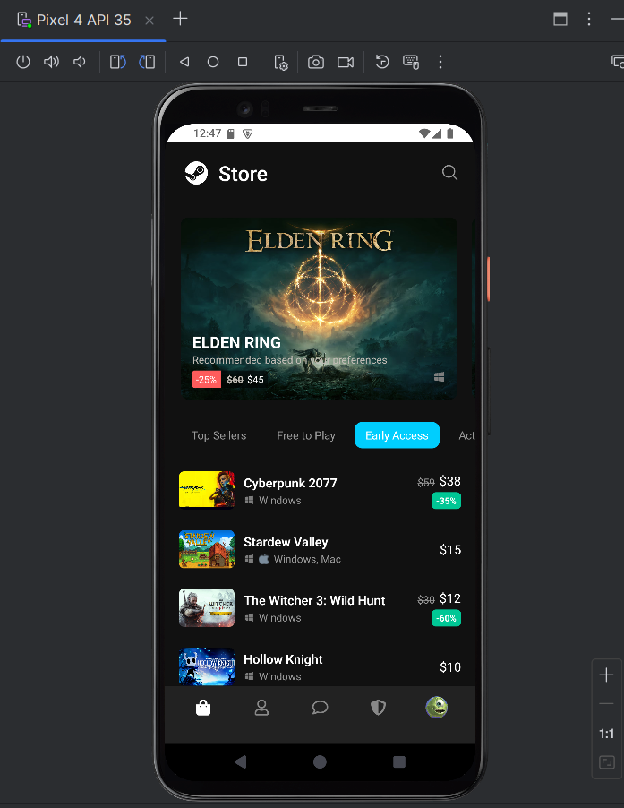
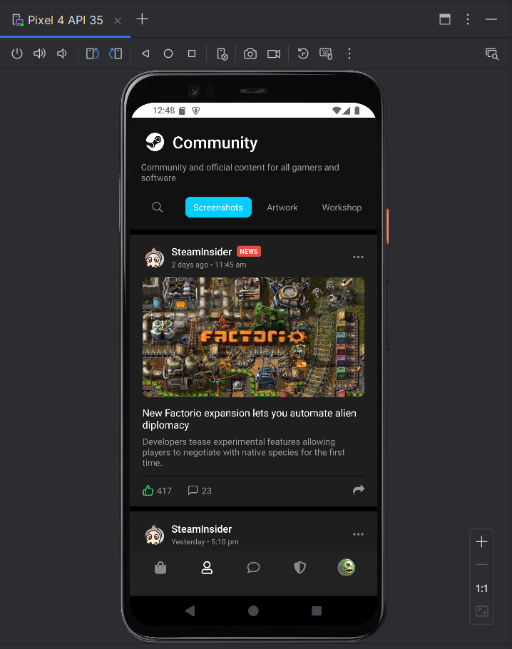
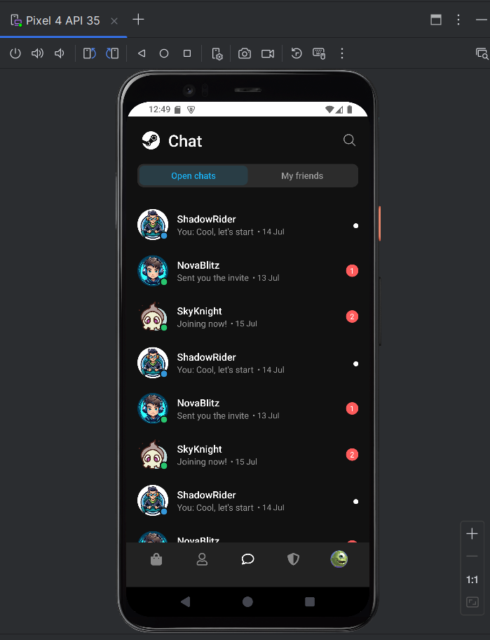
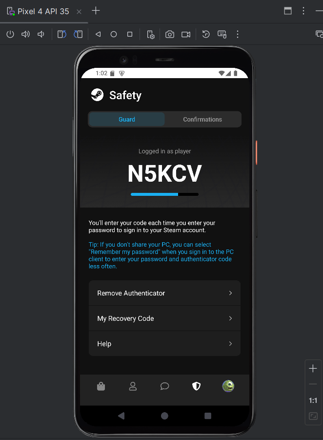
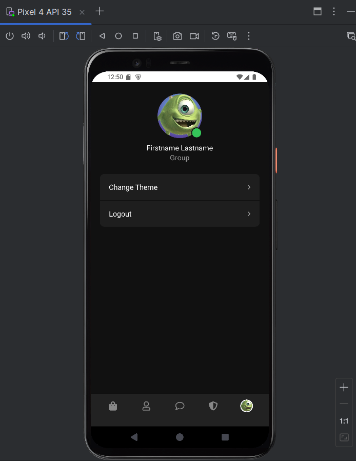

#### light theme
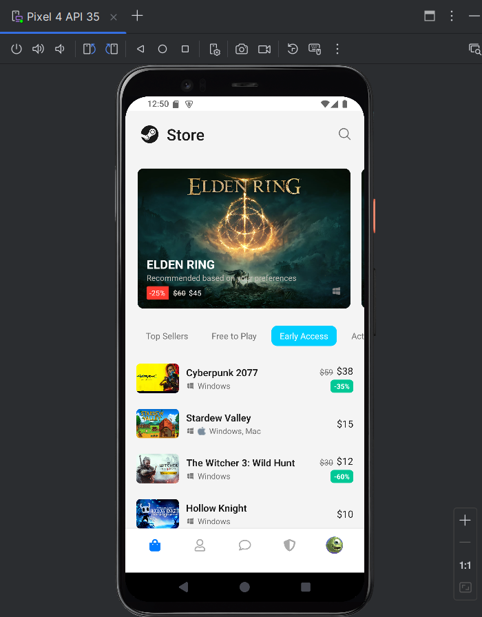
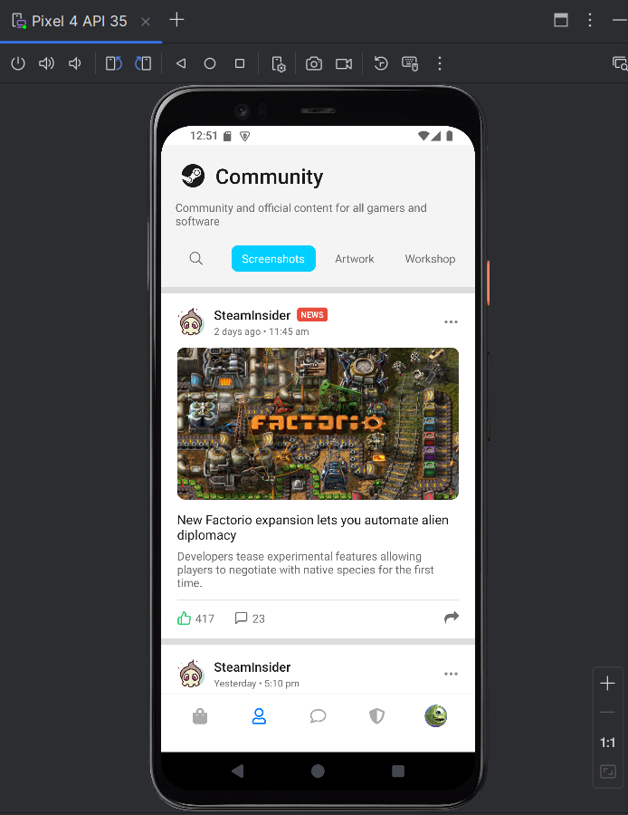
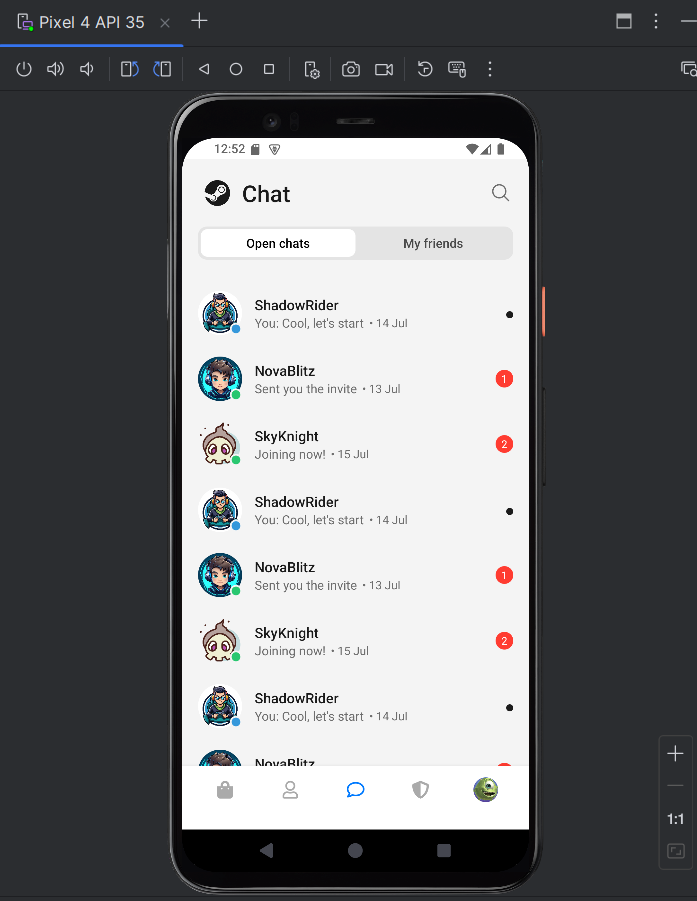
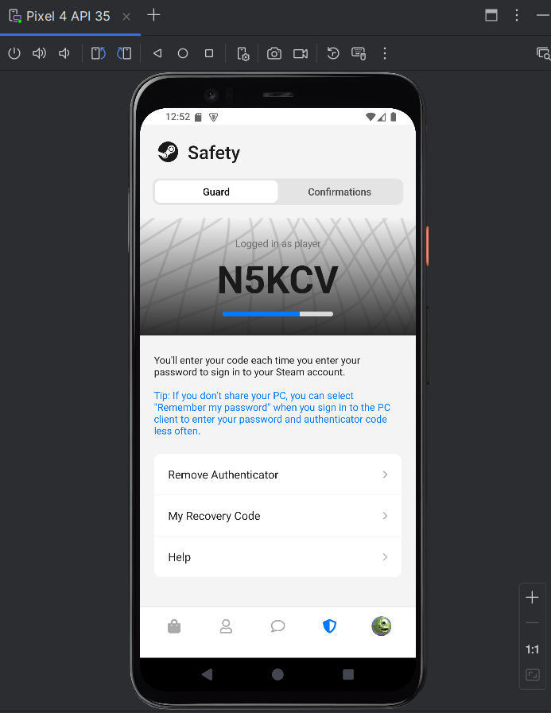
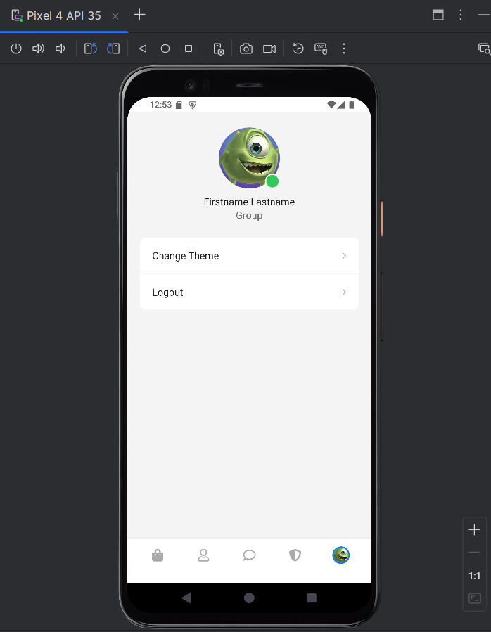

### lab3


### lab4

### lab5
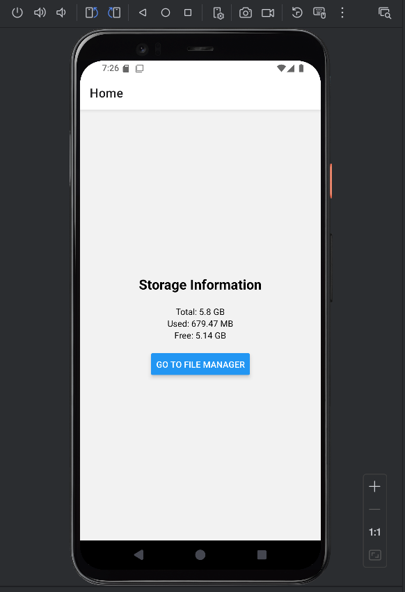
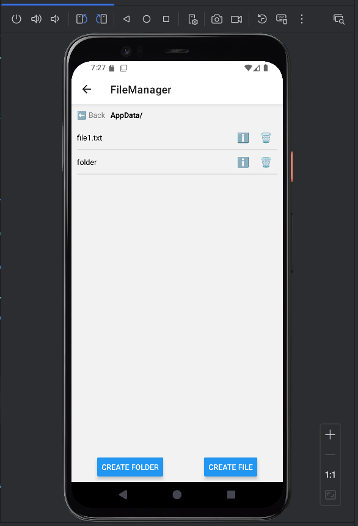
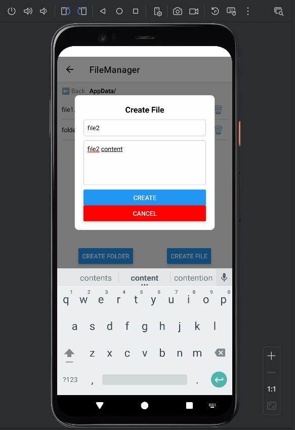
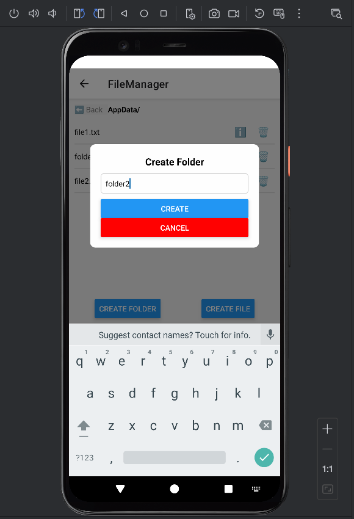
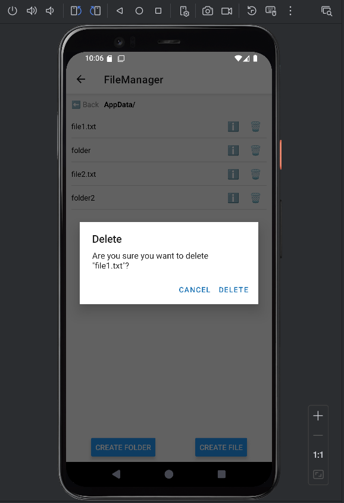
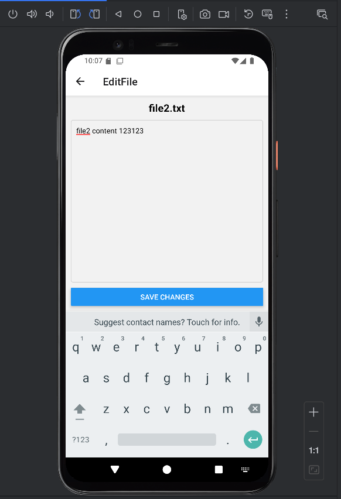
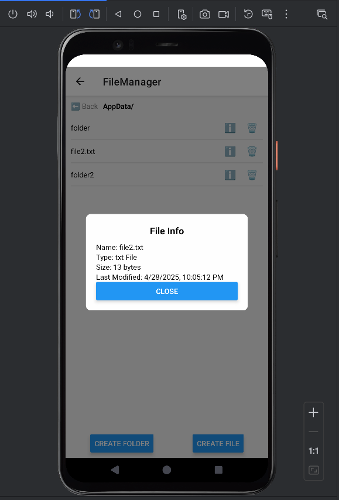

### lab6