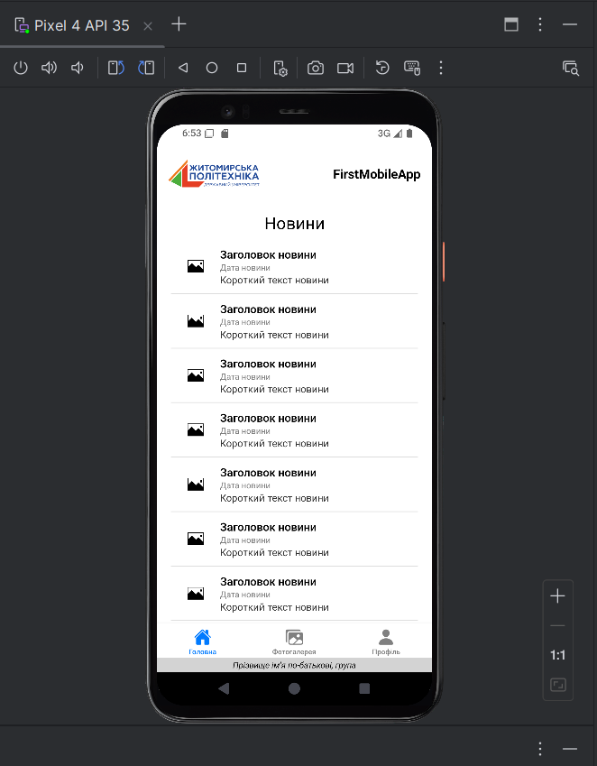
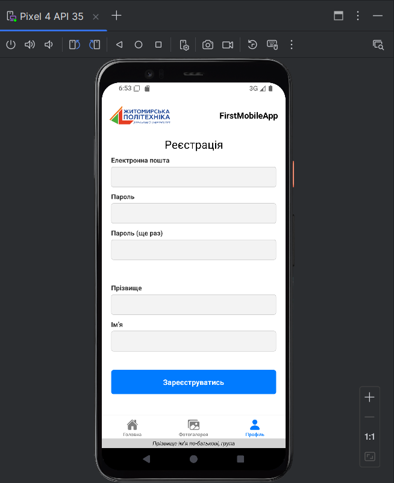
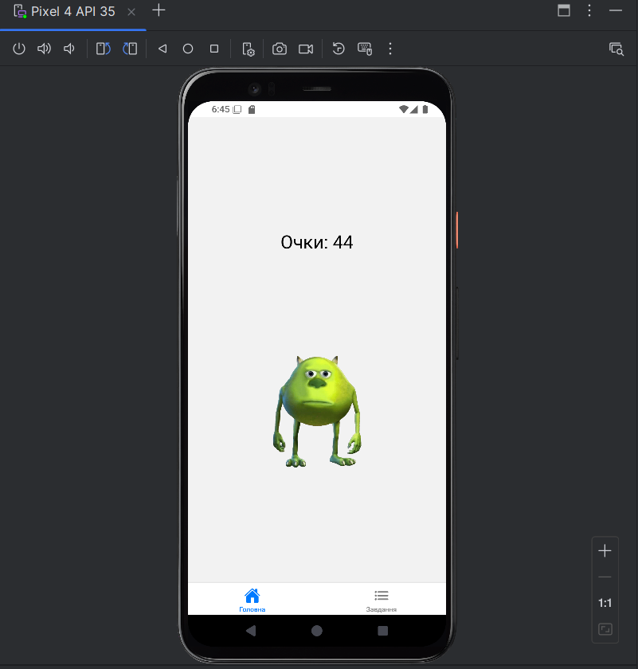
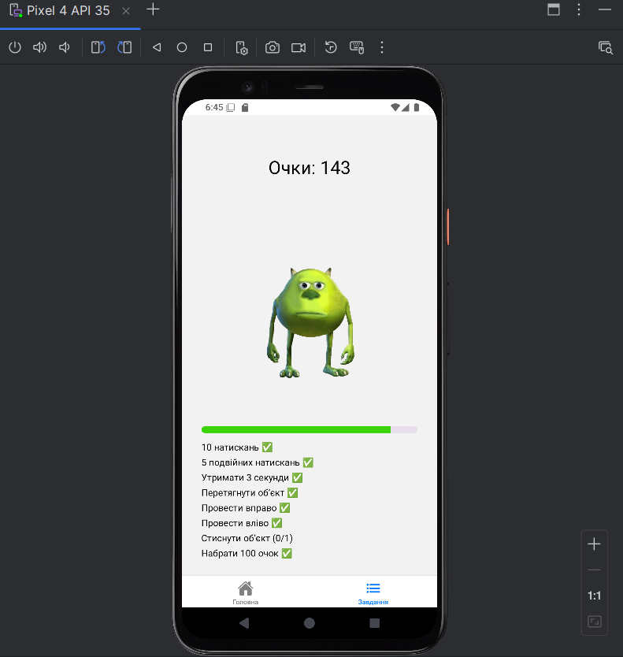

## Running the Android App

To launch the **Android version** of the application on an emulator or a connected device, run:

```bash
npm run android
```

## Скріншоти
### lab1




### lab2

### lab3



### lab4

### lab5

### lab6